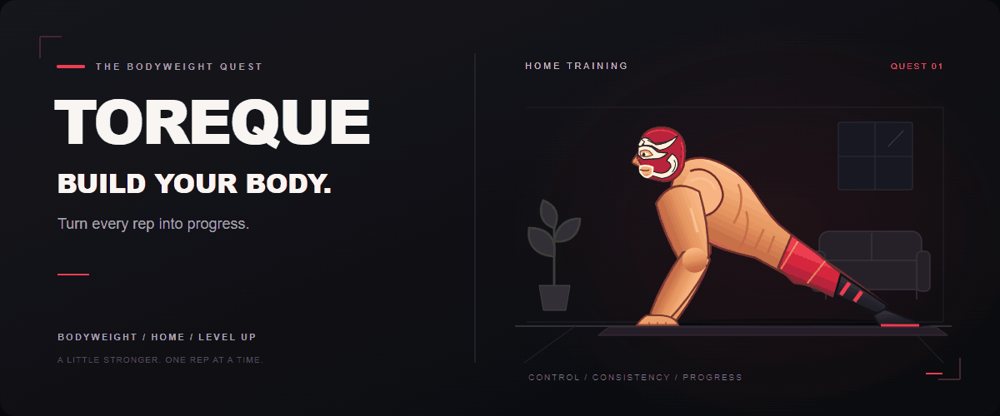

## 👋 About Me

東京電機大学 情報システム工学科  
Webアプリ開発を中心に学習・制作しています。

## 🎮 Toreque / トレクエ

筋トレ初心者が、器具なしの家トレをRPG感覚で継続できるWebアプリです。

目的・鍛えたい部位・運動時間などに合わせてトレーニング内容を調整し、
XP・レベル・ステージなどのゲーム要素を取り入れています。

▶️ [トレクエを使ってみる](https://jota-0704.github.io/toreque/)

### ⏱ ±0

10.00秒ぴったりで止めることを目指す、シンプルなストップウォッチゲームです。

▶️ [±0をプレイする](±0のURL)

### 🛠 Tech Stack

HTML / CSS / JavaScript / Supabase
